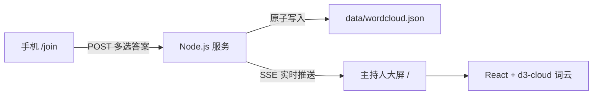

# WordFlow · CityU 实时互动词云

一个可直接运行的现场互动词云：主持人在电脑上打开大屏，参与者用手机扫码匿名多选，答案通过 SSE 实时汇聚成中文词云。

> 固定题目：**初见CityU，你此刻的心情是？**

## 界面预览


<p align="center"><sub>主持人大屏：实时词云、参与二维码、回答数和热门答案统计</sub></p>

## 项目特点

- 无需 Supabase、数据库账号或参与者登录。
- 主持人大屏与手机答题页分离，自动生成局域网参与二维码。
- 20 个预设心情选项，支持一次多选。
- “其他”可输入 1–6 个 Unicode 字素。
- 相同答案自动合并，频次越高，词云字号越大。
- Server-Sent Events 实时更新；断线自动重连，并用轮询兜底。
- 每个浏览器每轮限答一次；多选多个词仍计为 1 份回答。
- 回答保存在本地 JSON 文件中，重启服务不会丢失。
- 主持人密钥保护“清空答案”操作。

## 界面与视觉样式

### 主持人大屏

| 区域 | 样式与行为 |
| --- | --- |
| 整体背景 | 深海军蓝 `#09091b`，叠加低透明网格、紫色和青色环境光 |
| 题目区 | 大字号白色题目，紫色“本轮问题”标签，回答数与题目同一行 |
| 词云卡片 | 半透明毛玻璃面板、细描边、柔和阴影和暗色点阵背景 |
| 词云颜色 | 珊瑚红、薰衣草紫、天蓝、青绿、琥珀黄、靛蓝和粉红 |
| 词频映射 | 高频词更大，使用平方根比例压缩极端差距，最多显示 80 个不同答案 |
| 排布方式 | 中文词保持水平排列，不随机旋转；悬停时增加亮度和发光 |
| 二维码区 | 右侧独立卡片，包含二维码、参与地址和复制按钮 |
| 统计区 | 展示参与人数、不同答案数量和热门词排行 |

### 手机参与页

- 浅紫白渐变背景与毛玻璃卡片。
- 21 个圆角复选卡片（20 个预设选项＋“其他”）。
- 选中后显示紫色边框、浅紫背景与勾选图标。
- 选择“其他”后显示输入框及 `0/6` 字数计数。
- 适配小屏滚动，并在窄屏使用两列选项布局。

全局样式位于 [`src/index.css`](./src/index.css)，词云颜色和字号规则位于 [`src/components/WordCloudVisualization.jsx`](./src/components/WordCloudVisualization.jsx)。

## 系统如何工作



| 层级 | 技术 | 说明 |
| --- | --- | --- |
| 前端 | React 18 + Vite | 主持人大屏、手机答题页和开发热更新 |
| 词云 | d3-cloud | 根据词频计算字号与排布 |
| 二维码 | qrcode.react | 生成局域网或公网参与地址 |
| 后端 | Node.js HTTP Server | REST API、SSE、静态资源与主持人权限 |
| 存储 | JSON 文件 | 默认保存到 `data/wordcloud.json` |

开发环境中，`server.mjs` 将 Vite 作为中间件加载；生产环境中，同一个 Node.js 进程同时提供 `dist` 前端文件和 API。因此不需要分别启动两个终端。

## 快速开始

### 1. 环境要求

- Node.js 18 或更高版本，推荐 Node.js 20/22 LTS。
- npm。
- 局域网扫码时，电脑和手机连接同一个 Wi-Fi。

```bash
node --version
npm --version
```

### 2. 安装并配置

```bash
cd /Users/fluffywood/projects/wordcloud/coding-challenge-word-cloud
cp .env.example .env
npm install
```

### 3. 一条命令启动前后端

```bash
npm run dev
```

也可以运行一键脚本：

```bash
./init.sh
```

启动成功后终端会显示：

```text
WordFlow 已启动
主持人大屏: http://localhost:5173/?admin=...
手机参与页: http://192.168.x.x:5173/join
数据文件: .../data/wordcloud.json
```

### 4. 页面地址

| 地址 | 用途 |
| --- | --- |
| `http://localhost:5173/?admin=...` | 主持人大屏；首次请使用终端输出的完整地址 |
| `http://localhost:5173/` | 普通大屏查看地址 |
| `http://192.168.x.x:5173/join` | 手机参与页，也是二维码内容 |
| `/api/health` | 服务健康检查 |

按 `Ctrl+C` 可以停止服务。

## 完整前后端配置

### 前端配置

主要文件：

```text
src/
├── App.jsx                              # 根据 / 或 /join 切换页面
├── config/pollConfig.js                # 固定题目、选项和“其他”限制
├── components/HostView.jsx             # 主持人大屏
├── components/ParticipantView.jsx      # 手机多选页
├── components/WordCloudVisualization.jsx
├── hooks/useLivePoll.js                # API、SSE 与重连
└── index.css                           # 桌面与手机样式
```

题目、选项和“其他”字数上限统一放在 `src/config/pollConfig.js`：

```js
export const POLL_QUESTION = '初见CityU，你此刻的心情是？'
export const PRESET_OPTIONS = ['期待', '兴奋', '好奇']
export const OTHER_OPTION = '其他'
export const OTHER_MAX_LENGTH = 6
```

当前完整选项：

> 期待、兴奋、好奇、开心、激动、新鲜、憧憬、充满希望、自信、放松、紧张、忐忑、迷茫、陌生、不安、压力、挑战、归属感、幸运、充实、其他。

`POLL_VERSION` 标记持久化结构版本。修改数据结构时应升级该值；仅修改文案或选项时无需升级。修改共享配置或 `server.mjs` 后请重启开发服务；生产环境还需要重新构建。

前端请求同源 `/api/*`，不需要配置 `VITE_API_URL`。

### 后端配置

服务会自动读取项目根目录的 `.env`：

```env
PORT=5173
HOST=0.0.0.0

# 公网部署时填写来源地址，不要包含 /join
# PUBLIC_URL=https://wordflow.example.com

# 公网部署时强烈建议显式设置
# ADMIN_KEY=replace-with-a-long-random-string

# WORDCLOUD_DATA_FILE=/app/data/wordcloud.json
# MAX_RESPONSES=2000
# MAX_SSE_CLIENTS=500
```

| 变量 | 默认值 | 作用 |
| --- | --- | --- |
| `PORT` | `5173` | Node.js 与 Vite 共用的服务端口 |
| `HOST` | `0.0.0.0` | 监听所有网卡；局域网扫码需要此配置 |
| `PUBLIC_URL` | 自动推断 | 二维码使用的公网或局域网来源地址，不带 `/join` |
| `ADMIN_KEY` | 自动生成 | 保护清空答案操作 |
| `WORDCLOUD_DATA_FILE` | `./data/wordcloud.json` | 回答持久化文件，所在目录必须可写 |
| `MAX_RESPONSES` | `2000` | 单轮最多回答份数 |
| `MAX_SSE_CLIENTS` | `500` | 最大同时 SSE 连接数 |

未设置 `ADMIN_KEY` 时，服务会生成随机密钥并保存到数据目录中的 `.admin-key`。首次打开终端输出的 `/?admin=...` 地址后，密钥会保存在该浏览器中，并自动从地址栏移除。

不要公开 `.admin-key` 或带 `?admin=` 的主持人地址。

### API 接口

| 方法 | 地址 | 说明 |
| --- | --- | --- |
| `GET` | `/api/health` | 健康检查和当前回答数 |
| `GET` | `/api/state?sessionId=...` | 获取问题、公开回答、个人提交状态和参与链接 |
| `GET` | `/api/events?sessionId=...` | SSE 实时状态流 |
| `POST` | `/api/responses` | 提交一份多选回答 |
| `DELETE` | `/api/responses` | 清空回答，需要 `X-Admin-Key` |

提交格式示例：

```json
{
  "questionId": "current-question-id",
  "sessionId": "unique-participant-id",
  "selectedOptions": ["期待", "兴奋", "其他"],
  "otherText": "惊喜"
}
```

服务端会验证选项白名单、重复项、问题 ID、重复提交，以及“其他”的 1–6 字限制，不能通过绕过前端提交无效答案。

### 数据持久化

默认数据文件：

```text
data/wordcloud.json
```

每位参与者对应一条 response，多选词保存在 `answers[]` 中。数据通过临时文件和原子替换写入。请确保 Node.js 进程对数据目录有写权限；容器或云端部署必须挂载持久化磁盘。

## 现场使用方法

1. 主持人在电脑上执行 `npm run dev`。
2. 打开终端打印的完整“主持人大屏”地址。
3. 将浏览器切换为全屏，并投影或共享到会场大屏。
4. 确保电脑和手机连接同一个 Wi-Fi。
5. 参与者扫描右侧二维码，选择一个或多个心情。
6. 选择“其他”时，输入不超过 6 个字的自定义词。
7. 提交后，大屏词云、回答数和排行榜会自动更新。
8. 活动结束或需要重新演示时，点击词云底部的“清空答案”。

### 答题与计数规则

- 一位参与者无论选择几个词，都计为 1 份回答和 1 位参与者。
- 每个被选中的词分别增加一次词频。
- 同一浏览器每轮只能提交一次，但这不是严格的防作弊系统。
- “其他”输入会直接作为词云词语，不会显示成字面上的“其他”。

## 生成 100 份随机回答

先保持 WordFlow 服务正在运行，再打开另一个终端：

```bash
cd /Users/fluffywood/projects/wordcloud/coding-challenge-word-cloud
npm run seed-demo -- 100
```

脚本会：

- 生成 100 个唯一参与者会话。
- 每份随机选择 1–3 个词。
- 使用有高低差异的权重，让热门词形成明显字号层级。
- 随机加入“惊喜”“温暖”“感动”等自定义词。
- 通过真实 API 逐份提交，触发正常的数据保存与实时推送。
- 完成后校验实际新增数量。

数量参数支持 1–1000。例如增加 300 份：

```bash
npm run seed-demo -- 300
```

该命令会在现有数据上**追加**，不会覆盖或自动清空。若需要恰好查看 100 份的效果，请先在主持人页面清空现有答案。

服务使用其他端口或主机时：

```bash
WORDFLOW_ORIGIN=http://127.0.0.1:5174 npm run seed-demo -- 100
```

Windows PowerShell：

```powershell
$env:WORDFLOW_ORIGIN="http://127.0.0.1:5174"
npm run seed-demo -- 100
```

## 生产环境部署

### 方式一：Node.js

```bash
npm ci
npm run build
npm start
```

生产环境建议至少配置：

```env
NODE_ENV=production
HOST=0.0.0.0
PORT=5173
ADMIN_KEY=replace-with-a-long-random-string
PUBLIC_URL=https://wordflow.example.com
WORDCLOUD_DATA_FILE=/absolute/persistent/path/wordcloud.json
```

### 方式二：Docker

构建镜像：

```bash
docker build -t wordflow .
```

运行并挂载持久化数据卷：

```bash
docker run -d \
  --name wordflow \
  --restart unless-stopped \
  -p 5173:5173 \
  -e PUBLIC_URL=https://wordflow.example.com \
  -e ADMIN_KEY=replace-with-a-long-random-string \
  -v wordflow-data:/app/data \
  wordflow
```

查看启动地址和日志：

```bash
docker logs -f wordflow
```

### Nginx 反向代理示例

```nginx
server {
    listen 80;
    server_name wordflow.example.com;

    location / {
        proxy_pass http://127.0.0.1:5173;
        proxy_http_version 1.1;
        proxy_set_header Host $host;
        proxy_set_header X-Forwarded-Proto $scheme;

        # SSE 实时推送需要关闭代理缓冲
        proxy_buffering off;
        proxy_cache off;
        proxy_read_timeout 1h;
    }
}
```

公网环境请配置 HTTPS，并将 `PUBLIC_URL` 设置为最终 `https://` 来源地址。

### 部署限制

- 需要常驻 Node.js 进程和可写持久化磁盘，不能部署到纯静态 GitHub Pages。
- JSON 文件方案只支持单实例或单 worker；多实例部署需要共享数据库和消息系统。
- 反向代理必须关闭 SSE 缓冲并增加读取超时。
- 公网部署必须使用 HTTPS、强 `ADMIN_KEY` 和持久化数据卷。
- 参与者填写的内容会公开展示，请勿提交个人敏感信息。

## 测试与验证

```bash
npm run lint
npm run build
npm test
```

`npm test` 会验证固定题目、多选提交、“其他”限制、防重复提交、SSE、主持人权限和 JSON 持久化。

健康检查：

```bash
curl -fsS http://127.0.0.1:5173/api/health
```

预期返回类似：

```json
{"ok":true,"responses":100}
```

## 项目命令

| 命令 | 作用 |
| --- | --- |
| `npm run dev` | 启动开发服务：前端热更新＋后端 API |
| `npm run build` | 构建生产前端 |
| `npm start` | 运行生产服务 |
| `npm run preview` | 本地预览生产构建 |
| `npm run seed-demo -- 100` | 通过 API 追加 100 份随机回答 |
| `npm run lint` | 执行 ESLint |
| `npm test` | 构建并运行端到端冒烟测试 |

## 项目结构

```text
coding-challenge-word-cloud/
├── data/                       # 回答数据与自动生成的主持人密钥
├── docs/images/                # README 界面截图
├── scripts/
│   ├── seed-demo.mjs           # 随机演示回答生成器
│   └── smoke-test.mjs          # API/SSE/持久化冒烟测试
├── src/                        # React 前端与前后端共享配置
├── .env.example                # 环境变量模板
├── Dockerfile                  # 两阶段生产镜像
├── init.sh                     # 本地一键启动
├── server.mjs                  # Node API、SSE 和静态文件服务
└── package.json
```

## 常见问题

### 5173 端口被占用

查看占用进程：

```bash
lsof -nP -iTCP:5173 -sTCP:LISTEN
```

确认是旧的 WordFlow 服务后优雅停止：

```bash
kill -TERM <PID>
```

也可以改用其他端口：

```bash
PORT=5174 npm run dev
```

### 手机扫码后无法打开

- 手机不能访问电脑的 `localhost`，应使用类似 `192.168.x.x` 的地址。
- 确认电脑和手机位于同一个 Wi-Fi。
- 允许 Node.js 通过 macOS/Windows 防火墙。
- 访客 Wi-Fi 可能开启客户端隔离，可换用普通 Wi-Fi 或手机热点。
- VPN 或多网卡可能导致自动选择错误 IP；可在 `.env` 中设置 `PUBLIC_URL`。

### 页面只显示深蓝色背景

1. 停止旧的 Vite/Node.js 进程。
2. 在项目根目录重新执行 `npm install`。
3. 执行 `npm run dev`。
4. 打开终端本次打印的地址并强制刷新浏览器。

### 二维码地址不正确

在 `.env` 中指定可访问的根地址，不要包含 `/join`：

```env
PUBLIC_URL=http://192.168.1.20:5173
```

### 清空答案时提示主持人密钥错误

重新打开本次启动时终端打印的完整 `/?admin=...` 地址。如果更换了 `ADMIN_KEY`，旧浏览器中保存的密钥也需要用新地址覆盖。

## 数据与授权说明

- `.admin-key` 和回答数据不应提交到公开仓库。
- “每个浏览器限答一次”用于现场体验，并非严格防作弊机制；清除浏览器数据或更换设备可以再次参与。
- 公开发布仓库前，请确认根目录中有适合使用场景的 `LICENSE`，并核对上游项目授权条款。
